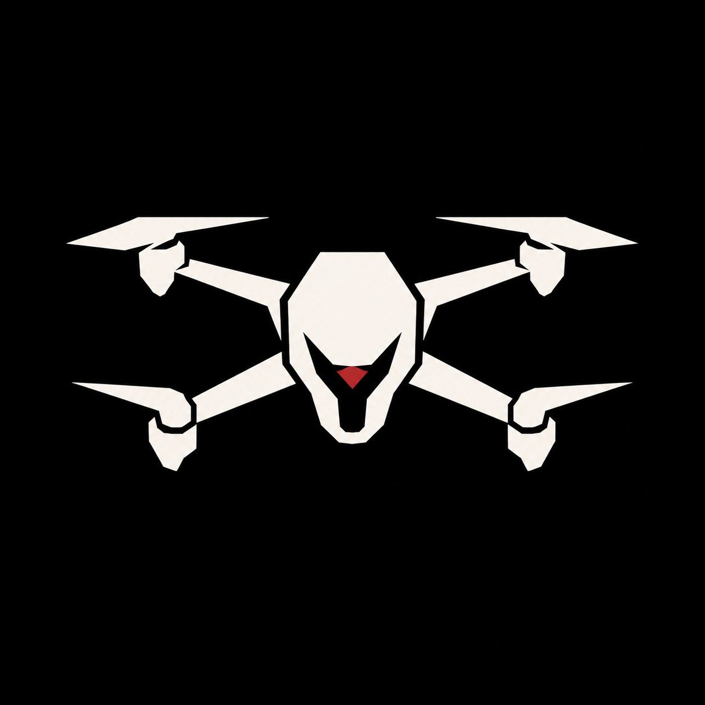

# Aerial

<div align="center">
  
</div>

Aerial is a Unity 3D space-arcade drone racing game. The drone moves forward automatically at fixed authored speed while the player controls horizontal and vertical positioning to pass through neon checkpoint rings, portals, and readable obstacle sections.

## Unity Version

Built for Unity `6000.0.74f1`.

## Open the Project

1. Open Unity Hub.
2. Add this folder as a project: `/Users/fawzmehfil/Desktop/Aerial`.
3. Open with Unity `6000.0.74f1`.
4. Open `Assets/Scenes/Main.unity`.

The project includes committed starter prefabs under `Assets/Prefabs`. The editor bootstrap script can also rebuild generated scene/prefab assets from the `Aerial/Rebuild Generated Scene And Prefabs` menu if needed.

You can also press Play from an empty Unity scene; the runtime bootstrap creates the game manager automatically before the scene loads.

## Verification

Run `Tools/verify_project_structure.sh` to check that the source project contains the expected Unity scene, packages, scripts, prefabs, and level data.

The project also includes a package-free Unity editor verifier that checks required gameplay types, level data, project assets, build settings, progression, and runtime level bootstrap. When Unity licensing is available, run it with:

```bash
/Applications/Unity/Hub/Editor/6000.0.74f1/Unity.app/Contents/MacOS/Unity \
  -batchmode -projectPath . \
  -executeMethod DriftEditor.DriftProjectVerifier.RunBatch \
  -logFile /tmp/drift-verifier.log \
  -quit
```

The same verifier is available from `Aerial/Run Project Verifier` inside the Unity editor.

## GitHub Notes

This repository is set up to commit source files, project settings, packages, scenes, prefabs, and their `.meta` files. Unity-generated folders such as `Library/`, `Temp/`, `Logs/`, and `UserSettings/` are intentionally ignored.

Before pushing, confirm the working tree is clean:

```bash
git status --short
```

## How to Play

- Use the main menu to play, start the tutorial, open level select, or adjust settings.
- All levels are accessible from level select without needing to beat previous courses.
- Each level select row has `Play` and `Practice` options.
- Practice mode places automatic checkpoints as you clear rings, respawns you at the latest checkpoint after a crash, and does not count as a normal completion.
- Fly through the highlighted current ring.
- Rings must be passed in order.
- Portals can temporarily change authored speed, gravity/orientation, or drone size.
- Missing the current ring, hitting an obstacle, or leaving the playable boundary quickly resets the level.
- Completing a level marks it complete locally.
- Completing a level in practice mode shows a practice completion screen and leaves normal completion progress unchanged.

## Controls

- `W`: move up
- `S`: move down
- `A`: move left
- `D`: move right
- `R`: restart current level
- `Esc`: pause, resume, or return from level select

There is no throttle, braking, or manual forward movement. Forward speed is fixed per level.

## Levels

The project includes an expanded accessible level set:

1. Tutorial - Launch Sequence: safe onboarding for movement, ring order, portals, restart, and pause.
2. Lightline Atrium: minimal white-light tunnel inspired by architectural corridor references.
3. Cyan Velocity Hall: cyan/magenta sci-fi corridor with speed portals.
4. Red Gate Foundry: industrial red rectangular gate course with wall and pillar hazards.
5. Cosmic Ring Void: open starfield ring tunnel with alien silhouettes and debris.
6. Sideways Spiral: sparse orientation portal set piece.
7. Aerial Expedition: longer mixed adventure course with corridor, void, portal chain, speed/size shifts, and final challenge.
8. Acheron: the longest and most difficult full-track gauntlet, using `Soundtracks/Acheron.mp3` from start to finish with gameplay sound effects suppressed.

## Adding Levels

Add another `LevelDefinition` entry in `Assets/Scripts/LevelCatalog.cs`.

Each level defines:

- Level number and display text
- Fixed forward speed
- Playable horizontal and vertical boundary
- Environment theme
- Ordered `RingSpec` positions and radii
- Optional `ObstacleSpec` positions and sizes
- Optional `PortalSpec` positions, types, radii, and durations
- Optional soundtrack path, soundtrack duration, and per-level gameplay SFX suppression
- Practice checkpoints are generated automatically from ring progress; use normal mode for saved completions.

The runtime managers generate the ring meshes, pass triggers, portal geometry, obstacle geometry, guide rails, theme environments, particles, drone, camera target, and UI from that data.

## Architecture

- `DroneController`: fixed forward movement, WASD positioning, portal-applied speed/orientation/size effects, practice snapshots, smoothing, damping, boundary checks, hitbox scaling, and visual tilt.
- `CameraFollow`: smooth chase camera, orientation roll following, and subtle FOV response to lateral and portal speed changes.
- `RingCheckpoint`: individual ring trigger and visual state.
- `RingManager`: ordered checkpoint progression, miss detection, and ring progress.
- `LevelManager`: builds and resets levels from `LevelDefinition` data.
- `GameManager`: game state, normal/practice starts, checkpoint respawns, pause/restart/failure/completion, soundtrack playback, audio feedback, and progression.
- `PortalBase`, `SpeedPortal`, `GravityPortal`, `SizePortal`, `PortalManager`: reusable authored portal system.
- `UIManager`: package-free runtime main menu, tutorial entry, level select, settings, HUD portal indicators, pause, failure, and completion panels.
- `LevelSelectManager`: all-level selection and completed/tutorial button state.
- `BoundaryReset`: playable volume failure detection.
- `ObstacleReset`: obstacle collision/failure detection.
- `RuntimeVisualFactory`: upgraded drone, neon rings, portal visuals, obstacle variants, theme environments, guide rails, particles, materials, and procedural audio helpers.
- `DriftProjectBootstrapper`: editor-only scene, build settings, and prefab generation.

Progress is saved locally with `PlayerPrefs` keys `Drift.HighestUnlockedLevel` and `Drift.CompletedLevels`; all levels remain selectable regardless of completion.
